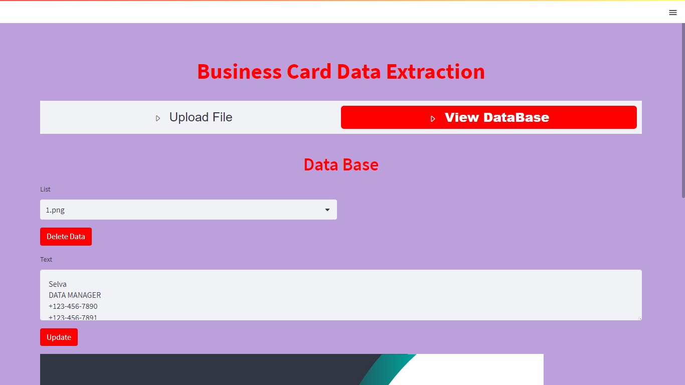

##  Business Card Data Extraction
## Project Overview 
This is a Streamlit application that allows users to upload an image containing a business card, extract the text from the image using OCR (Optical Character Recognition), and store the extracted text and image in a MySQL database. Users can also view the stored data from the database, edit the extracted text, and update the database accordingly.

You can install EasyOCR using the following command:

#### pip install easyocr

This command will use pip, the Python package installer, to download and install the EasyOCR library and its dependencies. Make sure you have Python and pip installed on your system before running this command.
## Prerequisites
Pandas - (To Create a DataFrame with the scraped data)

mysql.connector - (To store and retrieve the data)

Streamlit - (To Create Graphical user Interface)

EasyOCR - (To extract text from images)
## Installation
Clone the repository to your local machine:

#### git clone <repository_url>

Install the required dependencies modules using pip:

#### pip install librarynames
##  Configuration
Before running the application, you need to configure the MySQL database connection details in the code. Open the app.py file and modify the following variables with your MySQL database credentials:

db_host = 'your_host'

db_user = 'your_name'

db_password = 'your_password'

## Running the Application
To start the application, run the following command in your terminal:

streamlit run app.py

This will launch the Streamlit web app, and you can access it in your web browser at http://localhost:8501.
## Usage
### Upload File

1.Click on the "Upload File" option in the sidebar.

2.Choose an image file (supported formats: jpg, jpeg, png) containing a business card.

3.The uploaded image will be displayed on the page.

4.Click the "Extract Text" button to perform OCR on the image.

5.The extracted text will be displayed below the image.

6.You can edit the extracted text if needed.

### View Database

1.Click on the "View Database" option in the sidebar.

2.The page will display a list of uploaded files from the database.

3.Select a file from the list to view its details.

4.The image and extracted text will be displayed.

5.You can edit the extracted text if needed.

6.Click the "Update" button to save the changes to the database.

7.If you want to delete the data, click the "Delete Data" button.
## Database Schema
The application uses a MySQL database to store the extracted text and image data. The database schema consists of a single table named business_cards, which has the following columns:

id (INT): Primary key for each business card entry.

text (VARCHAR): Extracted text from the business card.

image (LONGBLOB): Binary data of the business card image.

file_name (VARCHAR): Name of the uploaded file.
## License
This project is licensed under the MIT License.

## Reference Link

https://www.linkedin.com/posts/prakash-subramanian-b5467b65_my-3rd-capstone-project-under-machine-learning-activity-7101157874030039041-GYLz?utm_source=share&utm_medium=member_desktop
